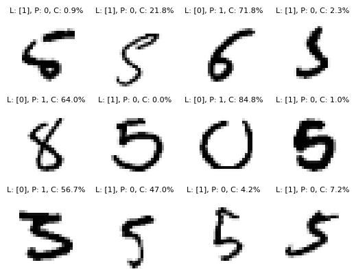

Este repo contiene el código del curso [Fundamentals of Machine Learning for SWE](https://www.educative.io/courses/fundamentals-of-machine-learning-for-software-engineers).
Todos los notebooks fueron escritos por mi siguiendo la teoría y ejemplos del curso + algunos capítulos del libro [Mathematics for machine learning](https://mml-book.github.io/)

 *Ejemplo de un plot generado en el notebook mnist.ipynb*